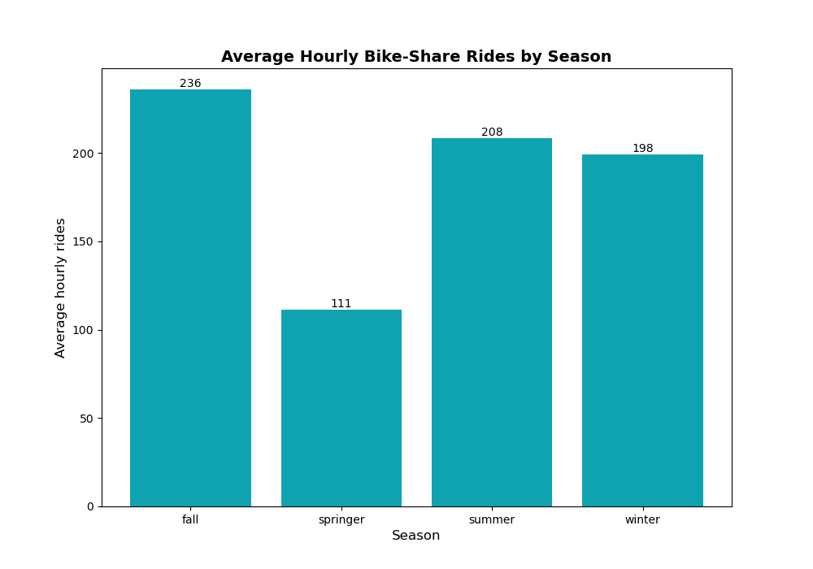
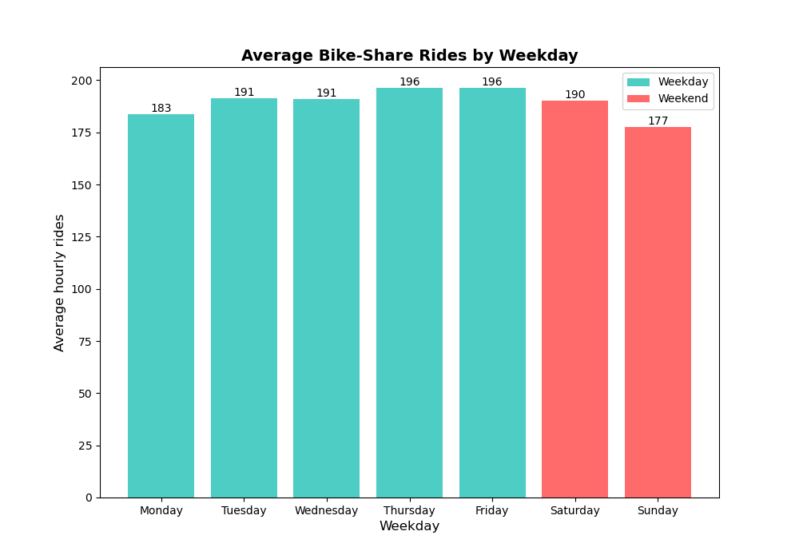
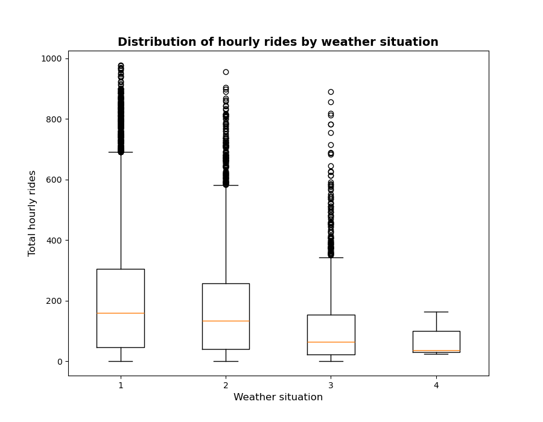

# Riding the Demand: Insights for a Bike-Share PM
## Project Owner: [Ibrahima Diallo](https://www.linkedin.com/ibranova)
## Business Framing and Stakeholders

This project analyzes hourly bike-share usage data to uncover demand patterns and generate actionable insights for key stakeholders:

* **Product Manager (PM):** Rider behavior, demand spikes, and priorities for future testing.
* **Operations Lead:** Staffing windows, rebalancing opportunities, and low-impact maintenance times.
* **Marketing Lead:** Promo timing and segmentation (casual vs. registered riders).
* **Policy & Ethics Advisor:** Ensure equity of access and responsible communication of uncertainty.

---

## Methods Summary

* **Exploratory Data Analysis (EDA):**

  * Imported the data using the pandas library in Python, checked for missing and duplicated values, and then performed data cleaning and feature engineering for some columns to better understand the data. For example, instead of having months in numbers starting from 0-12, I created a dictionary named Month_name in Python to map each number to its corresponding month. Next, I explored hourly ridership across time, season, weather, and user segments. Used descriptive statistics and visualizations (time-series plots, boxplots, histograms, heatmaps).
* **Hypothesis Testing:**

  * **Q1:** Compared average hourly rides between working vs. non-working days
     * For this hypothesis, I chose a Welch’s t-test because the data are independent and approximately normally distributed. Also, the sample is large, and we are comparing the means of two groups. (a.k.a. pairwise comparison).
  * **Q2:** Tested if mean hourly rides differ across seasons.
     * I used a `one-way ANOVA with post-hoc Tukey HSD` to perform this test because we are analyzing the difference between the means of more than 2 samples.
* **Simulated A/B Test:**

  * Measured the impact of a feature launch on early evening commuter-hour ridership. Designed with stratified balancing across weekday × hour × weather
  * Compared pre- vs. post-launch commuter-hour ridership.

---

## Top 3 Trends/Insights

1. **Seasonal Demand is Strongly Cyclical:** Summer and fall show peak ridership, while spring dips significantly. This insight can help Ops plan maintenance in low-demand months.

   
3. **Commuter Peaks Dominate Weekdays:** 8–9 AM and 5–7 PM are the highest ridership windows, especially for registered riders. This is critical for PM/Ops planning and Marketing targeting.

    
5. **Weather & Humidity Drive Demand:** Clear or misty days with humidity ≤ 70% see much higher ridership, while rain and snow sharply reduce usage. This will inform and enable the Marketing team for ime promos and Ops to anticipate sudden drops.
   
   

   
---

## Hypothesis Testing Results
### Q1 (Working vs. Non-working Days):
- Test: Welch’s t-test
- α = 0.05 (moderate risk tolerance—balancing false alarms vs. missed opportunities)
- Result: t ≈ 4.10, p = 0.00004, 95% CI ≈ [6.15,17.45] around [+20, +40 rides/hour].
- Decision: We reject the null hypothesis; there is a significant difference between the average hourly rides in working days and non-working days. The average hourly rides on working days
is greater than the average hourly rides on non-working days.
- Practical Significance: Large difference (~+30 rides/hour) actionable for staffing team.

### Q2 (Seasonal Differences):
- Test: One-way ANOVA (F ≈ 50, p < 0.001)
  
    
- Post-hoc: Tukey HSD revealed significant differences between winter and summer/fall.
- Decision: The results suggest that there is a statistically-significant difference in average hourly rides between Fall and Spring,
with Spring showing much higher means. Fall also significantly differs from both Summer and Winter, though with smaller differences. 
Spring is significantly higher than both Summer and Winter. However, no significant difference was found between Summer and Winter
- Practical Significance: Confirms cyclical seasonality, important for long-term planning and marketing campaigns.

---

## A/B Test Results (Commuter-hour Focus)
- Setup: Compared Pre (Aug 4–31, 2012) vs. Post (Sep 1–28, 2012), stratified by weekday × hour × weather.
- Metric: Average hourly rides (cnt) during 17–19h on working days, good weather, and humidity ≤ 0.70.
- Result:
  
   

- Interpretation:
While treatment B showed a higher average ridership than control A (about 44 more rides), this difference was not statistically significant at the conventional α = 0.05 level (p = 0.12). The confidence interval also includes zero, indicating uncertainty about whether the true effect is positive or negative.
- Conclusion & Practical Significance:
The feature change did not produce a statistically significant increase in commuter-hour ridership during the early evening. Further testing with a larger sample size or over a longer observation window may be needed to detect smaller but practically meaningful effects.
---
## Recommendations
### Product Manager:
- Prioritize feature experiments for 17:00–19:00 on working days, highest absolute demand, and most predictable commuting window. Consider micro-experiments to do some promotion to reward registered riders and prevent hurting customer retention.
- Weather-sensitive planning: avoid launches or large-scale promos on days with weather sit ≥ 3.

### Operations Lead
- Rebalance before 17:00 and schedule peak staffing around 16:30–18:30.
- Choose low-impact maintenance windows on nights/periods with low average usage (late night / early morning).

### Marketing Lead
- Time promotions on weekdays in late afternoon/early evening for registered riders; use messaging that favors registered users if retention is a goal.
- Weather-aware promotions: target good-weather days (weathersit=1) when conversion is likely higher.

## Ethics & Limitations

* **Observational Data:** Results may be influenced by unobserved events like holidays.
* **Assumptions:** Normality/variance may not fully hold, even if we used a great test. 
* **Equity Risks:** Only focusing on commuter-heavy times could disadvantage casual riders and weekend riders. 
* **Ethics:** Check or rebalance shift bikes away from certain neighborhoods or times that disadvantage particular user groups.
